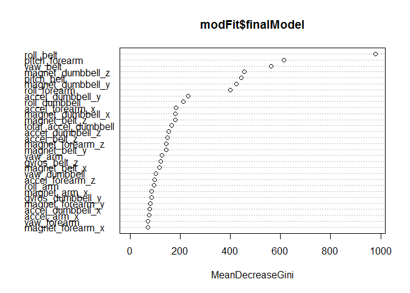

# PML Project
Bob Waters  
Friday, April 29, 2016  
ABSTRACT

A random forest procedure for determining how well a certain exercise is performed by identifying the proper motion and four common mistakes of the weight lifting exercise is described. Accelerometer data from three body positions and one on a dumbell were used to build the model.  These data are found in the Weight Lifting Exercises Dataset of the Human Activity (HAR) Recognition project, and can be accessed at http://groupware.les.inf.puc-rio.br/har.  The random forest model was used to accurately predict twenty unknown motions from a test dataset.

MODEL BUILDING

Required R Packages

The following R packages are required, and the training data loaded.


```r
options(warn = -1)
library(ggplot2)
library(dplyr)
```

```
## 
## Attaching package: 'dplyr'
## 
## The following objects are masked from 'package:stats':
## 
##     filter, lag
## 
## The following objects are masked from 'package:base':
## 
##     intersect, setdiff, setequal, union
```

```r
library(caret)
```

```
## Loading required package: lattice
```

```r
library(doParallel)
```

```
## Loading required package: foreach
## Loading required package: iterators
## Loading required package: parallel
```

```r
set.seed(17)

pml.training <- read.csv(url("https://d396qusza40orc.cloudfront.net/predmachlearn/pml-training.csv"))
```

Factor Selection

The training dataset was cleaned so that the resulting dataset contains only data and these data are in common with the test dataset.  The resulting clean dataset contains 53 columns, 52 factors and and 1 outcome, "classe."   This dataset was the subdivided into training data set to be used for model building and a test dataset for validation purposes.  Due to computer limitations, the dataset was split evenly (p = 0.5). 


```r
cln.training<-select(pml.training,8:11,37:49,60:68,84:86,102,113:124,140,151:160)

inTrain<-createDataPartition(y=cln.training$classe,p=0.5,list=FALSE)
train<-cln.training[inTrain,]
test<-cln.training[-inTrain,]
```

Model 1

The first model developed uses all 52 factors to predict the outcome.  K-fold cross validation was used for error estimation of the training data.  A K of 5 was used to split the training data into about 7850 samples for error estimation against the remaining data used for model training.


```r
fitControl <- trainControl(method = "cv",
                           number = 5,
                           allowParallel = TRUE)

modFit<-train(classe~.,
              data=train, 
              method="rf",
              trControl= fitControl,
              prox=TRUE)
```

```
## Loading required package: randomForest
## randomForest 4.6-12
## Type rfNews() to see new features/changes/bug fixes.
## 
## Attaching package: 'randomForest'
## 
## The following object is masked from 'package:dplyr':
## 
##     combine
## 
## The following object is masked from 'package:ggplot2':
## 
##     margin
```

```r
modFit
```

```
## Random Forest 
## 
## 9812 samples
##   52 predictor
##    5 classes: 'A', 'B', 'C', 'D', 'E' 
## 
## No pre-processing
## Resampling: Cross-Validated (5 fold) 
## Summary of sample sizes: 7849, 7852, 7850, 7848, 7849 
## Resampling results across tuning parameters:
## 
##   mtry  Accuracy   Kappa      Accuracy SD  Kappa SD   
##    2    0.9863436  0.9827210  0.002607103  0.003299510
##   27    0.9873615  0.9840104  0.001825190  0.002308842
##   52    0.9800238  0.9747256  0.003560249  0.004500121
## 
## Accuracy was used to select the optimal model using  the largest value.
## The final value used for the model was mtry = 27.
```

The resulting model gave a high resubstitution accuracy of 98.7% from the 5 fold cross validation.  The variable importance was determined for this model.


```r
varImp(modFit)
```

```
## rf variable importance
## 
##   only 20 most important variables shown (out of 52)
## 
##                      Overall
## roll_belt             100.00
## pitch_forearm          61.87
## yaw_belt               56.53
## magnet_dumbbell_z      45.43
## pitch_belt             44.18
## magnet_dumbbell_y      42.24
## roll_forearm           39.78
## accel_dumbbell_y       22.19
## roll_dumbbell          20.16
## accel_forearm_x        17.16
## magnet_dumbbell_x      16.94
## magnet_belt_z          16.83
## total_accel_dumbbell   15.21
## accel_dumbbell_z       13.95
## accel_belt_z           13.45
## magnet_forearm_z       13.04
## magnet_belt_y          13.02
## yaw_arm                11.34
## gyros_belt_z           10.77
## magnet_belt_x          10.27
```

The variable importance is shown graphically below.


```r
varImpPlot(modFit$finalModel)
```

 

The model depends mostly on seven variable that are distinctly more important than the remaining factors.  These important factors as determined by the Gini index are: roll_belt, pitch_forearm, yaw_belt, magnet_dumbbell_z, pitch_belt, magnet_dumbell_y, and roll_forearm.

Model 2

A second random forest model was built that used only the seven most important factors.  Again, the training dataset was divided evenly with the same random seed to ensure the same data split selection.  Model 2 was trained using 5 fold cross validation.


```r
run.training<-select(pml.training,8:10,120:123,160)
inTrain.run<-createDataPartition(y=run.training$classe,p=0.50,list=FALSE)
train.run<-run.training[inTrain.run,]
test.run<-run.training[-inTrain.run,]

modRun<-train(classe~.,
              data=train.run, 
              method="rf",
              trControl=fitControl,
              prox=TRUE)
modRun
```

```
## Random Forest 
## 
## 9812 samples
##    7 predictor
##    5 classes: 'A', 'B', 'C', 'D', 'E' 
## 
## No pre-processing
## Resampling: Cross-Validated (5 fold) 
## Summary of sample sizes: 7850, 7849, 7849, 7850, 7850 
## Resampling results across tuning parameters:
## 
##   mtry  Accuracy   Kappa      Accuracy SD  Kappa SD   
##   2     0.9753360  0.9688120  0.003960148  0.005009428
##   4     0.9741132  0.9672642  0.002659167  0.003362979
##   7     0.9701384  0.9622347  0.004229004  0.005347917
## 
## Accuracy was used to select the optimal model using  the largest value.
## The final value used for the model was mtry = 2.
```

Model 2 performed nearly as well as Model 1 with modestly lower accuracy of 97.5 compared to 98.7.

The confusion matrices of the models were compard.  First the 52 factor Model 1.


```r
cm.mf<-confusionMatrix(modFit)
cm.mf
```

```
## Cross-Validated (5 fold) Confusion Matrix 
## 
## (entries are percentages of table totals)
##  
##           Reference
## Prediction    A    B    C    D    E
##          A 28.4  0.3  0.0  0.0  0.0
##          B  0.1 19.0  0.2  0.0  0.0
##          C  0.0  0.1 17.1  0.3  0.0
##          D  0.0  0.0  0.1 16.0  0.1
##          E  0.0  0.0  0.0  0.0 18.2
```

And Model 2.


```r
cm.mr<-confusionMatrix(modRun)
cm.mr
```

```
## Cross-Validated (5 fold) Confusion Matrix 
## 
## (entries are percentages of table totals)
##  
##           Reference
## Prediction    A    B    C    D    E
##          A 28.0  0.3  0.0  0.0  0.0
##          B  0.2 18.5  0.2  0.0  0.3
##          C  0.2  0.4 17.0  0.2  0.1
##          D  0.0  0.1  0.2 16.1  0.1
##          E  0.0  0.1  0.0  0.0 18.0
```

The confusion matrices of the training data are similar with the 7 factor model showing the expected lower values.  

To get a better sense of model accuracy, the hold out test data from the splits were used to make predictions.  First Model 1 was run.


```r
testFit<-predict(modFit,test)
cm.tf<-confusionMatrix(testFit,test$classe)
cm.tf
```

```
## Confusion Matrix and Statistics
## 
##           Reference
## Prediction    A    B    C    D    E
##          A 2783   16    0    0    0
##          B    3 1874   19    1    2
##          C    1    6 1684   14    9
##          D    0    0    8 1593    8
##          E    3    2    0    0 1784
## 
## Overall Statistics
##                                           
##                Accuracy : 0.9906          
##                  95% CI : (0.9885, 0.9924)
##     No Information Rate : 0.2844          
##     P-Value [Acc > NIR] : < 2.2e-16       
##                                           
##                   Kappa : 0.9881          
##  Mcnemar's Test P-Value : NA              
## 
## Statistics by Class:
## 
##                      Class: A Class: B Class: C Class: D Class: E
## Sensitivity            0.9975   0.9874   0.9842   0.9907   0.9895
## Specificity            0.9977   0.9968   0.9963   0.9980   0.9994
## Pos Pred Value         0.9943   0.9868   0.9825   0.9901   0.9972
## Neg Pred Value         0.9990   0.9970   0.9967   0.9982   0.9976
## Prevalence             0.2844   0.1935   0.1744   0.1639   0.1838
## Detection Rate         0.2837   0.1910   0.1717   0.1624   0.1819
## Detection Prevalence   0.2853   0.1936   0.1747   0.1640   0.1824
## Balanced Accuracy      0.9976   0.9921   0.9903   0.9944   0.9944
```

Predictions on the subdivided test set by Model 1.


```r
testRun<-predict(modRun,test.run)
cm.tr<-confusionMatrix(testRun,test.run$classe)
cm.tr
```

```
## Confusion Matrix and Statistics
## 
##           Reference
## Prediction    A    B    C    D    E
##          A 2752   35    2    0    3
##          B   15 1817   13    6   20
##          C   19   32 1684   14    5
##          D    4   14    9 1584    8
##          E    0    0    3    4 1767
## 
## Overall Statistics
##                                          
##                Accuracy : 0.979          
##                  95% CI : (0.976, 0.9817)
##     No Information Rate : 0.2844         
##     P-Value [Acc > NIR] : < 2.2e-16      
##                                          
##                   Kappa : 0.9734         
##  Mcnemar's Test P-Value : 1.018e-09      
## 
## Statistics by Class:
## 
##                      Class: A Class: B Class: C Class: D Class: E
## Sensitivity            0.9864   0.9573   0.9842   0.9851   0.9800
## Specificity            0.9943   0.9932   0.9914   0.9957   0.9991
## Pos Pred Value         0.9857   0.9711   0.9601   0.9784   0.9961
## Neg Pred Value         0.9946   0.9898   0.9966   0.9971   0.9955
## Prevalence             0.2844   0.1935   0.1744   0.1639   0.1838
## Detection Rate         0.2805   0.1852   0.1717   0.1615   0.1801
## Detection Prevalence   0.2846   0.1907   0.1788   0.1650   0.1808
## Balanced Accuracy      0.9903   0.9752   0.9878   0.9904   0.9896
```

As seen with the training data, the confusion matrices of the training data are similar with the 7 factor model showing the expected lower values given that the test set accuracy is 97.8% compared to 99.1% for the 52 factor model. 

TEST PREDICTIONS

Both models were that used to predict the twenty sample test set supplied for the course quiz.  The results for these predictions are below.


```r
pml.testing <- read.csv(url("https://d396qusza40orc.cloudfront.net/predmachlearn/pml-testing.csv"))

data.tf<-select(pml.testing,8:11,37:49,60:68,84:86,102,113:124,140,151:159)
data.tr<-select(pml.testing,8:10,120:123)

pred.tf<-predict(modFit,data.tf)
pred.tr<-predict(modRun,data.tr)

results<-cbind(as.character(pred.tf),as.character(pred.tr))
colnames(results)<-c("Model.1","Model.2")
results
```

```
##       Model.1 Model.2
##  [1,] "B"     "B"    
##  [2,] "A"     "A"    
##  [3,] "B"     "B"    
##  [4,] "A"     "A"    
##  [5,] "A"     "A"    
##  [6,] "E"     "E"    
##  [7,] "D"     "D"    
##  [8,] "B"     "B"    
##  [9,] "A"     "A"    
## [10,] "A"     "A"    
## [11,] "B"     "B"    
## [12,] "C"     "C"    
## [13,] "B"     "B"    
## [14,] "A"     "A"    
## [15,] "E"     "E"    
## [16,] "E"     "E"    
## [17,] "A"     "A"    
## [18,] "B"     "B"    
## [19,] "B"     "B"    
## [20,] "B"     "B"
```

The methods gave identical predictions.  For practical considerations, Model 2 is less complicated, and therefore less likely to overfit.  However, it would seem from the results of both methods that overfitting is not a problem.  There was no noticable reduction in processing time between the two methods, but since Model 1 has a slightly higher accuracy it is probably the best of the two methods developed.

